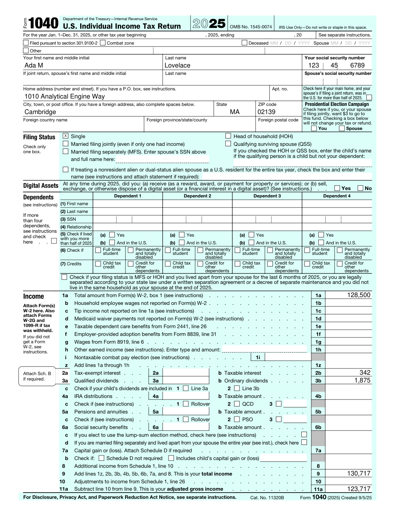
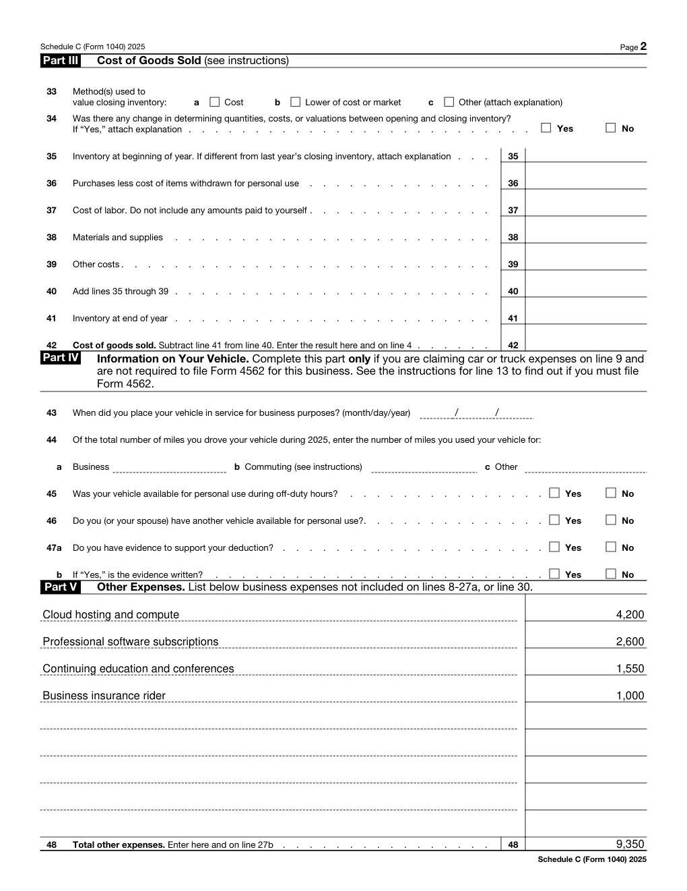

# Instead Tax Form Annotation

A data format for annotating the boxes on a U.S. tax form, plus a small reference
renderer that stamps computed values onto the real IRS PDFs. I built it around
**Form 1040** and **Schedule C**, and everything below — including the two filled
forms — is produced by running the code in this repo.

**▶ Live demo: https://instead-x-anindya.netlify.app** — edit the taxpayer data and
watch it print onto the real form in your browser.

|                                                  |                                                             |
| ------------------------------------------------ | ----------------------------------------------------------- |
|  |  |

---

## How I read the problem

The task isn't "fill a PDF" — it's to design the **layer in between**. Instead
already computes a taxpayer's numbers; a blank IRS form is a fixed visual
template. What's missing is a portable description that says, for each box on the
form: _which_ value goes there, _where_ it sits, and _how_ it should look. That
description has to be something anyone's code can consume to print values on top
of the form.

So the deliverable I focused on is the **annotation format itself** — documented
in [`spec/SPEC.md`](spec/SPEC.md) and enforced by a JSON Schema — and I wrote a
renderer only to prove the format is complete enough to actually drive output.

## The decisions I made

**1. Coordinate-native, not a wrapper around the PDF's own fields.**
I chose to have the annotation carry the geometry of every box itself
(`{ page, x, y, w, h }`) rather than reference the form's interactive-field names.
The brief explicitly asks the spec to own positioning, and this keeps it
format-agnostic: the same annotation works on a flattened or scanned form that
has no interactive fields at all. The form's own fields become a convenience I
can bootstrap from, not a dependency I'm locked into.

**2. I bootstrapped accurate coordinates from the forms' AcroForm layer.**
The hard, tedious part of overlaying values on a real form is finding the
coordinates of dozens of boxes. When I opened the IRS PDFs I noticed they ship as
interactive **AcroForm** documents — every field already carries its exact
rectangle. So I wrote a one-time [`bootstrap`](src/bootstrap.ts) step that reads
those rectangles straight out of the PDF and emits a coordinate skeleton. I then
labeled the boxes I cared about with their _meaning_ and _formatting_. That gave
me pixel-accurate positions in minutes instead of eyeballing them — but because
the coordinates are copied into my own format, the spec stays self-contained.

**3. A deliberately small path grammar for reaching nested data.**
Values come from a "deeply nested data set," so I needed a way to point at, say,
`income.w2[0].wages`. I resisted pulling in full JSONPath. A restricted grammar —
dot segments and integer indices only — is enough to reach any value, parses in a
single split-and-walk (O(depth)), carries no evaluation/injection risk, and is
simple enough that I can validate the references _themselves_ with a schema
pattern. If real conditional logic ever shows up, that's the moment to reconsider,
not before.

**4. I modeled the messy cases, because that's where a format earns its keep.**
Anyone can place a string at an (x, y). What makes an annotation format credible
is the awkward stuff on real forms, so I made sure each is a first-class concept:

- **Checkboxes / radio groups** — a `when: { equals: … }` condition; filing
  status is just several checkbox fields over the same value.
- **Segmented values** — a value spread across several boxes (the SSN comb), via a
  `rect` array. You can see it on the 1040: `123 45 6789` lands across the box.
- **Repeating rows** — Schedule C's Part V "Other expenses" is a `repeat` field
  bound to an array, with a row stride; one annotation describes all nine rows.
- **Currency / alignment / shrink-to-fit** — right-aligned money with thousands
  separators, and text that auto-shrinks to fit its box down to a legibility floor.

**5. Fail loud, never silent-wrong.**
An annotation is bound to a specific PDF revision (`form.source`, with page sizes
and a hash). Before drawing anything, the renderer validates the annotation
against the schema and asserts the loaded PDF's pages match the source. A missing
value simply prints nothing rather than crashing. The failure modes are all
defined in the spec, not left to chance.

## How it fits together

```
Blank IRS PDF (AcroForm) ──► bootstrap ──► coordinate skeleton
                                                 │  (I label meaning + formatting)
                                                 ▼
Taxpayer data (nested JSON) ─────────► annotation.json  ── the deliverable
                                                 ▼
                              render (validate → resolve → format → draw)
                                                 ▼
                                         filled PDF
```

| Path                                                                         | Responsibility                                     |
| ---------------------------------------------------------------------------- | -------------------------------------------------- |
| [`spec/SPEC.md`](spec/SPEC.md)                                               | The human-readable specification                   |
| [`spec/instead.annotation.schema.json`](spec/instead.annotation.schema.json) | JSON Schema (draft 2020-12) — the machine contract |
| [`src/resolve.ts`](src/resolve.ts)                                           | Restricted-path resolver into nested data          |
| [`src/format.ts`](src/format.ts)                                             | Value formatting by type                           |
| [`src/geometry.ts`](src/geometry.ts)                                         | Alignment, baseline, shrink-to-fit (pure math)     |
| [`src/draw.ts`](src/draw.ts)                                                 | Drawing primitive: text into a box on a page       |
| [`src/validate.ts`](src/validate.ts)                                         | Schema validation of an annotation document        |
| [`src/fieldRenderers.ts`](src/fieldRenderers.ts)                             | Strategy registry: one renderer per field type     |
| [`src/render.ts`](src/render.ts)                                             | Orchestrator: validate → dispatch → save           |
| [`src/bootstrap.ts`](src/bootstrap.ts)                                       | AcroForm rectangles → coordinate skeleton          |
| [`tools/fieldmap.ts`](tools/fieldmap.ts)                                     | Authoring aid: stamps field ids onto the form      |
| [`web/`](web/)                                                               | Interactive browser demo (reuses the renderer)     |
| [`annotations/`](annotations/)                                               | The 1040 and Schedule C annotations                |
| [`examples/`](examples/)                                                     | Sample nested data sets                            |
| [`output/`](output/)                                                         | Prebuilt filled PDFs (view without installing)     |

## Running it

The filled forms are committed in [`output/`](output/), so you can see the result
without installing anything. To reproduce them:

```bash
npm install
npm test          # 23 tests across resolver, formatter, geometry, schema, render
npm run lint      # eslint (clean)
npm run typecheck # tsc --noEmit (clean)

# Fill the real forms (outputs land in ./output)
npm run render -- annotations/1040.annotation.json      examples/1040.data.json      forms/f1040.pdf   output/1040.filled.pdf
npm run render -- annotations/scheduleC.annotation.json examples/scheduleC.data.json forms/f1040sc.pdf output/scheduleC.filled.pdf
```

## Interactive demo

The same renderer runs in the browser — `pdf-lib` and the pure modules have no Node
dependencies. The demo in [`web/`](web/) lets you edit the taxpayer data and watch
the annotation print it onto the real IRS PDF live. It's, in effect, the "proprietary
code" the spec is meant to drive.

```bash
npm run dev:web      # local dev server
npm run build:web    # static build to web/dist (deploy this)
```

Deployed on Netlify (build `npm run build:web`, publish `web/dist`) — **live at
https://instead-x-anindya.netlify.app**.

## Annotating a new form

Bootstrapping gets the _coordinates_ automatically, but a form's boxes carry only
the IRS's opaque field ids (`f1_14`, `c1_8[0]`) — nothing that says "first name."
Attaching meaning is a one-time manual step, done with a visual reference:

**1. Extract the coordinate skeleton** — every box, with its page and rect:

```bash
npm run bootstrap -- forms/f1040.pdf us.irs.1040 2025 "Form 1040" > annotations/1040.skeleton.json
```

**2. Generate a field map** — the same boxes, but with each id stamped onto the
actual form so you can _see_ which id is which box:

```bash
npm run fieldmap -- forms/f1040.pdf output/f1040.fieldmap.pdf
```

Open `output/f1040.fieldmap.pdf` (a copy is committed): the "Your first name" box is
labelled `f1_14`, the Single checkbox is `c1_8[0]`, line 1a is `f1_47`, and so on.

**3. Label the boxes you need** in `annotations/<form>.annotation.json`. For each,
copy the rect straight from the skeleton and add the meaning — a semantic `id`, the
`value.$ref` into your data, the `type`, and any `format`/`layout`. The coordinates
are never re-typed or eyeballed; only the labelling is human judgment. That manual
matching is exactly what the future **visual annotation editor** (below) would
replace with click-a-box-and-name-it.

## What I'd add next

- **A visual annotation editor** — drag boxes on the rendered PDF instead of
  hand-labeling a skeleton. The bootstrap already gets you 90% of the way.
- **Expression support** in references, if conditional or computed values are
  needed (kept out for now on purpose — see decision 3).
- **Multi-form return bundles** — render a 1040 and all its schedules in one pass
  from a single dataset.
- **Round-trip verification** — read values back out of a filled form to check
  them against the source data.
- **Font embedding** for non-Latin names and per-form font packs.
